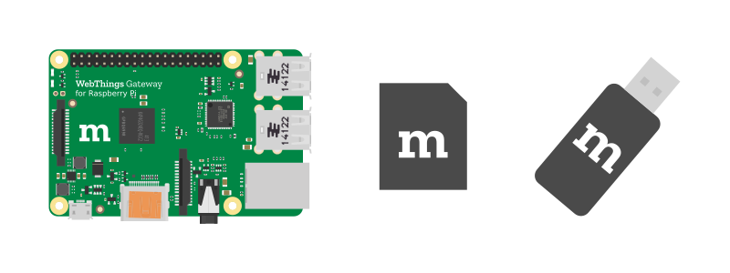
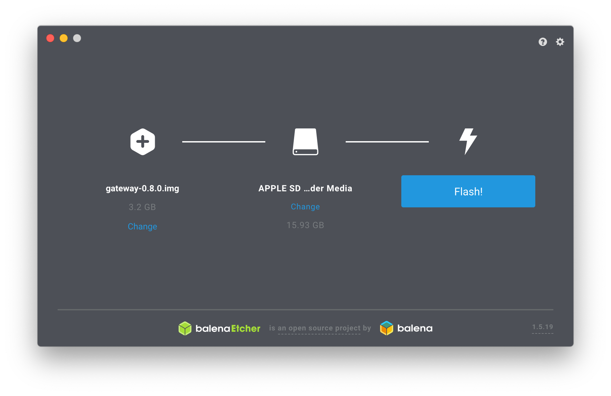
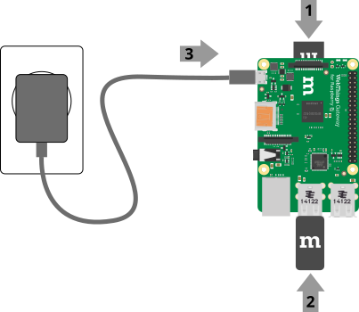
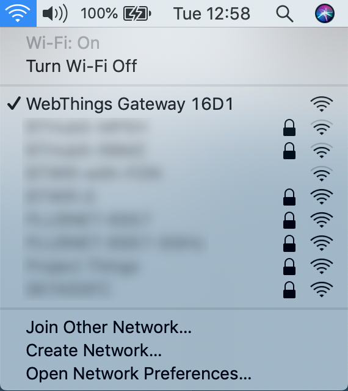
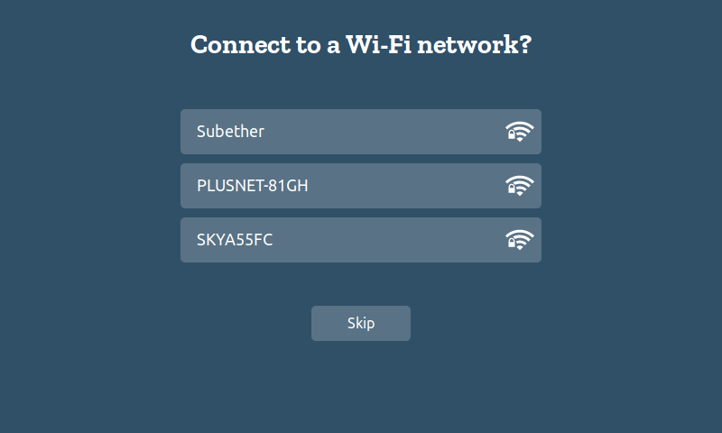
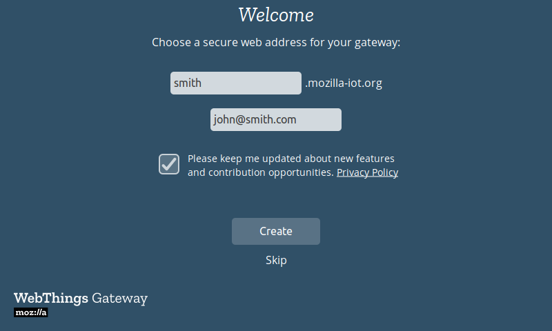
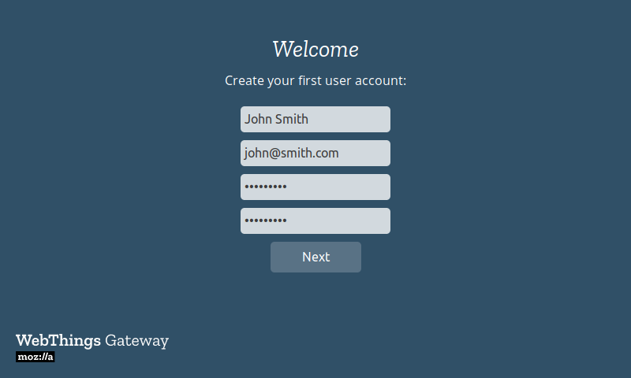
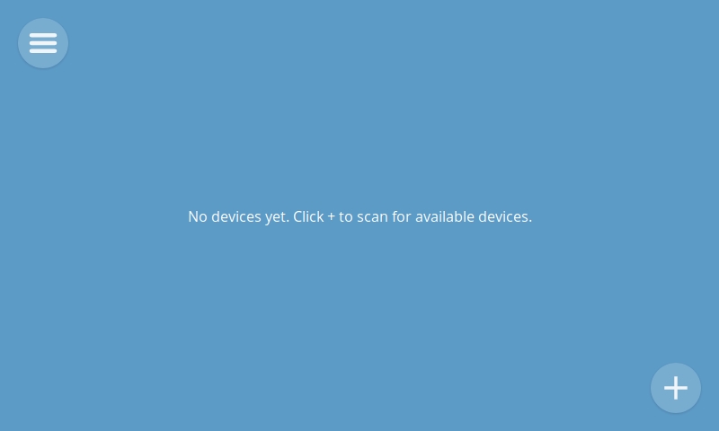

# Getting Started

## WebThings Gateway for Raspberry Pi®

[WebThings Gateway](https://iot.mozilla.org/gateway/) is a software distribution for smart home gateways which allows users to directly monitor and control their smart home over the web, without a middleman.

### What you will need

1. **A [Raspberry Pi®](https://www.raspberrypi.org/products/)** single board computer and power supply (Raspberry Pi 3 recommended, with minimum 2A power supply)
2. **A microSD card** (At least 8GB, class 10 recommended)
3. **USB dongles** (see the list of [compatible adapters](https://github.com/mozilla-iot/wiki/wiki/Supported-Hardware#adapters))

**Note:** The Raspberry Pi 3 comes with Wi-Fi and Bluetooth radios. The USB dongles are needed if you want to support other smart home protocols like Zigbee and Z-Wave.

### 1. Download Image

First download the latest gateway image from the [Mozilla IoT website](https://iot.mozilla.org/gateway/).

### 2. Flash Image

Next you will need to flash the downloaded image onto your microSD card. There are [various methods](https://www.raspberrypi.org/documentation/installation/installing-images/) of doing this but we recommend using [Etcher](https://www.balena.io/etcher/).

1. Open Etcher
2. Insert your SD card into an SD card reader attached to your computer
3. Select the downloaded image as the source file
4. Select your SD card as the target
5. Click "Flash!"

Once flashing is complete, remove the microSD card.

### 3. Boot Raspberry Pi

1. Insert the flashed microSD card into your Raspberry Pi
2. Plug in any USB dongles
3. Connect the power supply to boot the Pi
4. Check that the LEDs light up: red indicates power, green indicates activity
5. Wait a few minutes for the software to boot

**Note:** On first boot the Raspberry Pi may take an additional 2-3 minutes longer to boot in order to take care of some first time setup.

### 4. Connect Wi-Fi
Your gateway will most likely connect to the Internet and also communicate with all your devices via Wi-Fi, which needs to be set up next.

When the gateway starts up it will create a Wi-Fi hotspot called "**WebThings Gateway XXXX**" (where XXXX are four digits from your RPi's MAC address). Use a personal computer or smartphone to scan for and connect to that wireless network.

A captive portal page will appear, showing nearby Wi-Fi networks.  

Select the desired network and enter the password when prompted.  The "Connecting to WiFi..." page will automatically disappear.

**Notes:**
* If you are connected to the "WebThings Gateway XXXX" Wi-Fi network but you don't see the welcome screen, you can try typing http://192.168.2.1 into your web browser’s address bar to manually navigate to the page.
* As an alternative to Wi-Fi, you can connect the Raspberry Pi to your home network using an Ethernet cable and it will attempt to automatically get an IP address from your router. You can then start first time setup by typing "http://gateway.local" into your web browser.
* If you move the gateway to another location and it can no longer access your home network, it will revert to access point mode so you can connect to it and re-configure a different network.

### 5. Choose Subdomain

After you've connected the RPi to your wireless network, you should ensure that your laptop/tablet/smartphone is connected to the same Wi-Fi network and then navigate to **http://gateway.local** in your web browser.

You will then be given the option to register a free subdomain to safely access your gateway over the Internet using a [secure tunnelling service](https://github.com/mozilla-iot/wiki/wiki/Gateway-Remote-Access) provided by Mozilla.

Enter your choice of subdomain and an email address in case you need to retrieve your subdomain later to re-install on a new gateway. Click "Create" and wait a few moments for the subdomain registration to complete.  Try loading your subdomain on your smartphone or computer by loading https://SUBDOMAIN.mozilla-iot.org (where 'SUBDOMAIN' is the subdomain name you've chosen).

**Notes:**
 * You can choose to skip this step (either to only use the gateway locally on your home network or manually configure DNS yourself), but note that currently if you do skip this step you'll have to re-flash the gateway in order to register a subdomain.
 * If http://gateway.local fails to load (e.g. on Android or Windows) you can look up the IP address of the gateway on your home router and use that instead (look for a hostname of "gateway" or a MAC address starting with "b8:27:eb".
 * If neither http://gateway.local or http://<IP_address> will load in your browser, check to make sure your computer is definitely connected to the same Wi-Fi network you connected the gateway to.
 * If you have previously registered a subdomain you want to re-use, enter the subdomain and the email address you used to register it and follow the on-screen instructions to re-claim it.
 
### 6. Create User Account
Once you have registered your subdomain you should be automatically redirected to the next step of the setup process, which is to create your first user account on the gateway. This is how you'll access the gateway to discover, add, monitor and manage all your connected devices.  Enter your name, email address and a password then click "Next".

 
***Note:*** You can create additional user accounts later.
 
### Success!
You should then be redirected to an empty "Things" screen of the gateway where you can start to add devices.
 

 
See the [WebThings Gateway User Guide](./gateway-user-guide.md) to learn how to use your gateway including adding and managing smart devices, creating rules to automate your home, using logging to track data from your devices, and more.
