# User Guide

## WebThings Gateway for Raspberry Pi User Guide
[WebThings Gateway](https://iot.mozilla.org/gateway) by Mozilla is a software distribution for smart home gateways which allows users to directly monitor and control their smart home over the web, without a middleman.

This guide assumes you have already followed the [Getting Started Guide](https://mozilla-iot.github.io/docs/gateway-getting-started-guide.html) to bring your gateway online.

## I. Introduction

Congratulations on choosing to set up your own private Smart Home Gateway. This guide provides an overview of
what is currently referred to as the “WebThings Gateway” by Mozilla. This guide covers release version 0.8. Hereafter we will
usually just refer to it as the "gateway". 

The gateway lets you directly monitor and control your home over the web. Unlike many smart home hubs and connected 
IoT devices on the market, your data is not stored or processed in the cloud. It stays in your home on the gateway. 
The gateway can often bypass the need for you to purchase an IoT hub for each brand. And instead of downloading a 
different app for each brand, you can manage everything from one place, using any web browser.

This guide will explain how to customize your gateway, including connecting smart home devices, creating rules to automate 
your home, experimenting with voice and text-based commands, and a few additional tips.

The following image shows a typical collection of smart home devices, the top row shows the Raspberry Pi, power supply 
and a Zigbee USB dongle. The bottom row shows a door sensor, smart plugs, smart bulb, and motion sensor.

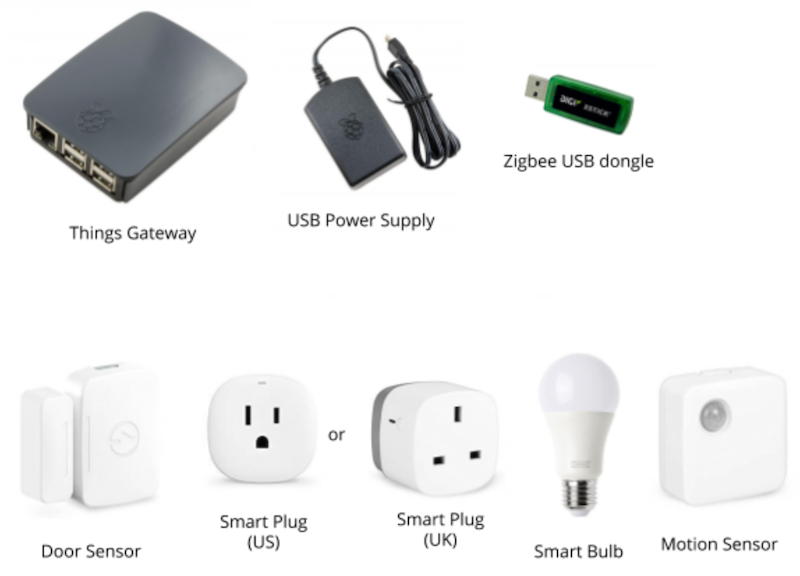

## II. Smartphone Application Convenience

Currently there is no specific smartphone application for the gateway, but you can load your unique gateway url into a smartphone browser application and save it to your home screen, which makes it work just like any other application. 

If you use Mozilla's tunneling service, your gateway url will be of the form `[your_subdomain].mozilla-iot.org`. 

We recommend that you **bookmark** the web address on all devices that you have access to from home. 
It is also handy to save your Things Gateway as a **web application on the home screen** of your phones and tablets.

On Android phones/tablets: 
* In Firefox: Select the “add to home” icon in the address bar (circled in red) to add an app icon to your home screen. 
* In Chrome: Select “Add Things to Home screen”. 

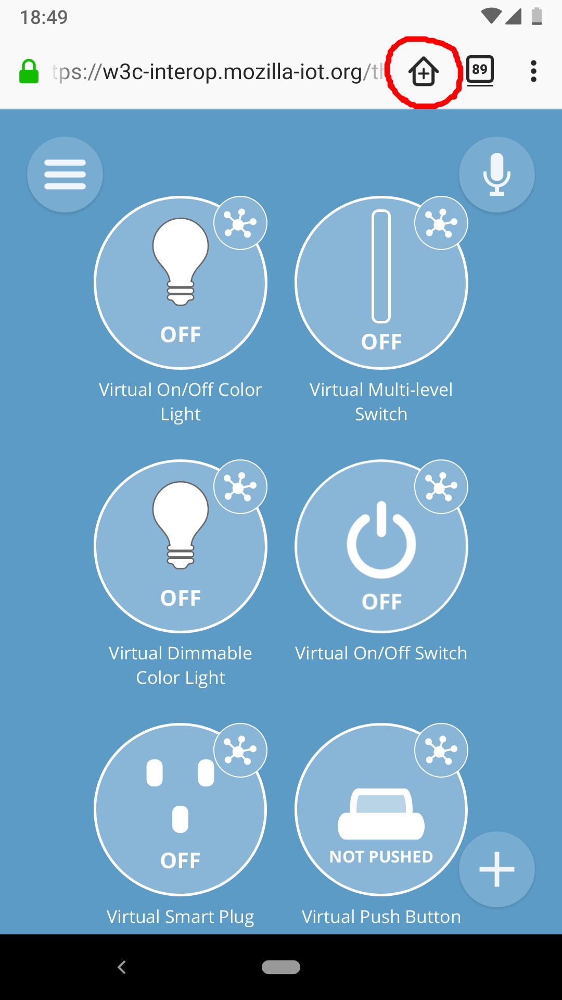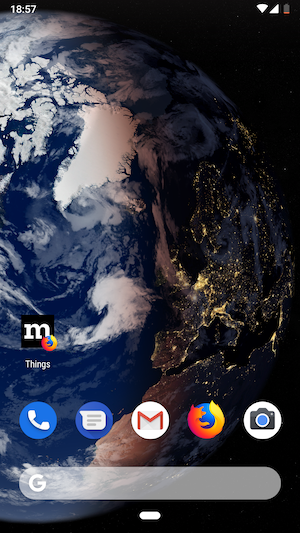

On iPhones and iPads: 
* In Safari: Select the Share icon, and then “Add to Home Screen”. 
* (Note that iOS does not currently support an "add to home screen" function for Firefox or Chrome browsers.)

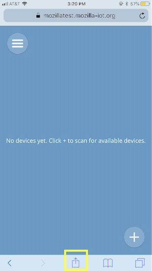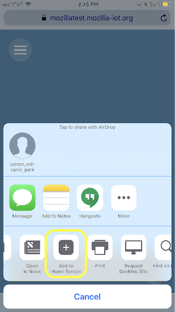

## III. Adding and Managing Smart Home Devices

The WebThings Gateway has an add-on system that lets it understand how different connected devices and services ("things") operate. For each type of device (or service) you'll need to install and configure the proper add-on so the gateway can use it to discover and connect to them as things.

A few add-ons are pre-configured as part of the standard gateway installation, especially those required for common smart home devices using Zigbee and Z-Wave communications technologies.  To make sure the gateway can discover all your devices it is best to first make sure all the right add-ons are installed and enabled.

### Add-ons

From the Main Menu, go to Settings and select Add-ons.  From the Add-ons page that appears, click on the "+" icon to bring up an alphabetical list of installable add-ons.  Add any and all Add-ons that correspond to smart devices you have in your home and wish to manage with the gateway, as well as services you may wish to use with your gateway.

As an example, the Weather add-on allows your gateway to connect to an open weather information service and display current conditions.  It is included in the list of available Add-ons, and can be added by clicking "+ Add":

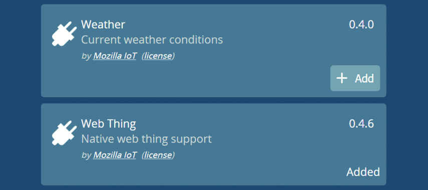

Click on the left arrow icon to return to the list of installed add-ons.  Find the Weather add-on and click "Configure":

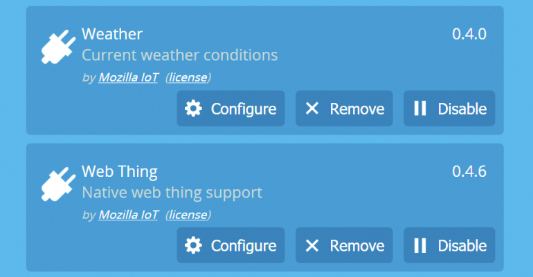

Configure the weather add-on:
* Enter the name of the location for which you want to track weather.
* Enter the latitude and longitude (which you can find on sites like www.latlong.net)
* You can user the default Open-WeatherMap API key

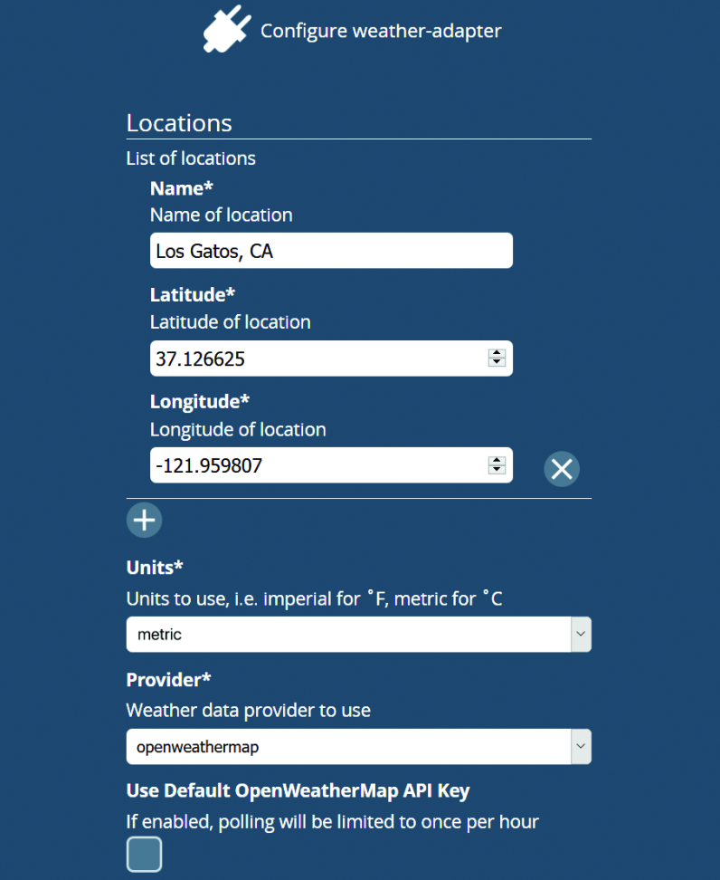

Return to the main Things page (https://SUBDOMAIN.mozilla-iot.org/things) and click the "+" icon to add a new thing.  Scanning for new devices should discover the Weather thing with the location name you specified.  Click "Save".

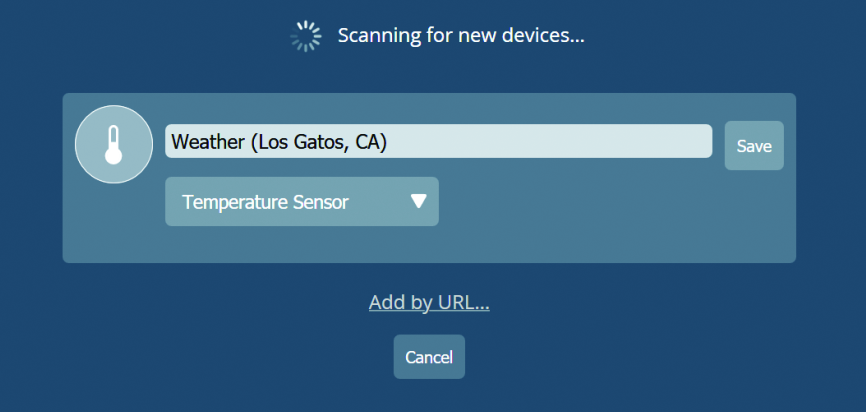

Now you can view weather data by going to the main Things page to see the installed weather thing:

### Scan For and Add Smart Devices

Now that your gateway is setup it's easy to discover connected devices in the environment around you.  By default the Raspberry Pi supports Wi-Fi, Bluetooth and Ethernet.  Additional accessories may be purchased to increase the number of devices your gateway can connect to.

Pick a device to add and prepare it for pairing. Typical preparation steps for Zigbee and Z-Wave devices are as follows:
* Smart bulb: screw into a light fixture that it is turned on (bulb should be lit when ready for pairing)
* Smart plug: plug into an outlet
* Other powered devices: plug in and turn on
* Battery-operated devices such as door/window sensors, motion detectors, pushbuttons, dimmer switches, leak detectors, 
temperature sensors, and more: remove tab from battery, or plug in battery, to power on

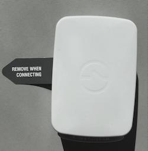

**TIP**: Some devices come pre-paired with controllers or IoT hubs. First follow the manufacturers instructions to do 
a **factory reset** on those devices before attempting to pair them with your Mozilla gateway. Refer to the appendix 
and to the wiki for more information.

When you are ready to add devices to your Things Gateway, we recommend that you provision devices one at a time. 

From the main “Things” page, select the 
button at the bottom right corner. 
The gateway will begin scanning to discover unprovisioned and unconfigured devices that are nearby.

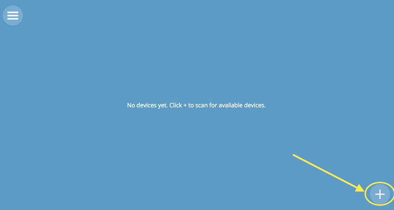

When a new device is found, it will appear on the Things scan page. Rename the device, then select 
‘Save’ to add it, and ‘Done’ when you are finished.

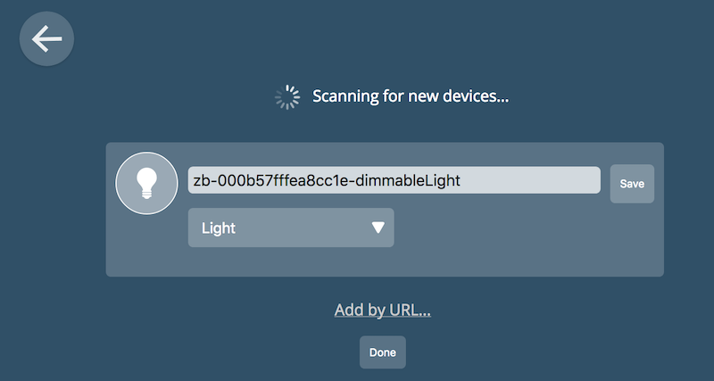

**TIP**: When naming your smart devices, we recommend using a name that helps you remember where they are 
located in your home. For example, “Bedroom Light”. Choose simple names that will be easy to remember and use if 
you want to command and control your home using voice commands.

Repeat these discovery steps for each device. Powering them up and scanning for them one at a time helps you 
identify each device. 

### Control Your Things

First learn how to monitor and control each device by checking out its capabilities. Then in the next section 
you can learn to create rules to automate interactions between devices.

Devices are displayed on the Things screen and the Floorplan screen. You can toggle light bulbs and smart plugs 
on and off by directly clicking on the device icon. You can also see the current state of devices such as 
door sensors and motion detectors, from these screens. 

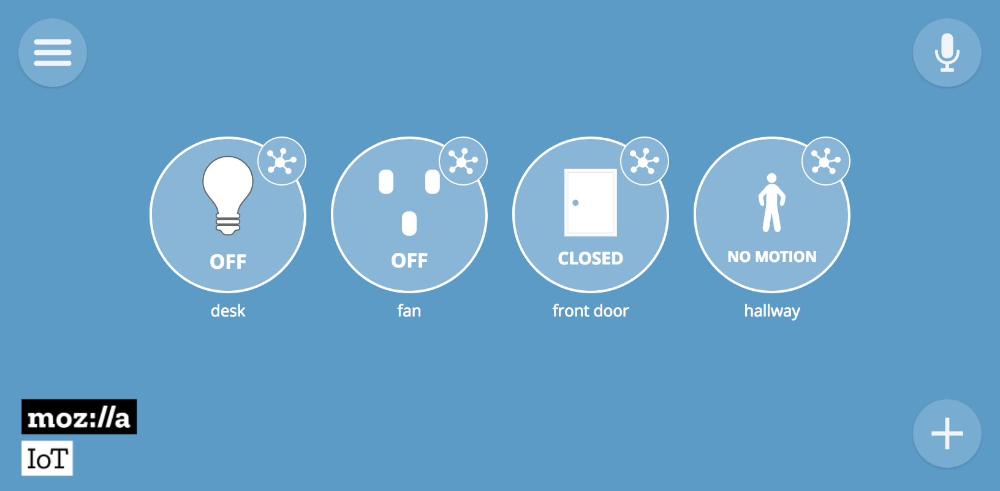

To view and control additional details, click the  icon 
toward the top-right of a device icon. A detailed thing page should open. 

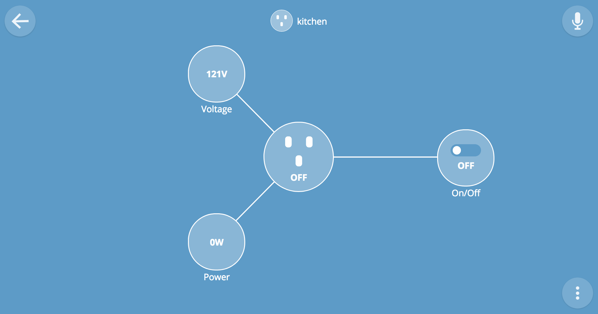

To edit a device’s name or remove it altogether, select 
the  icon in the bottom right-hand corner.

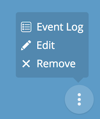

## IV. Rules: Automate Your Home

Now that your Mozilla Things Gateway is set up and your smart things are connected, you can start automating 
your home for your convenience by creating ‘Rules’. Practice creating a rule by following the next few steps. 

### Create a Rule

Navigate to the “Rules” page from the main menu. Click the  icon 
in the lower right corner to create a new rule. In Rule creation, the basic logic is: if (A), then (B). Optionally, 
you can change “if” to “while” and combine multiple inputs for (A), and take action against multiple outputs for (B). 

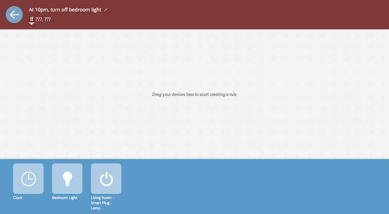

Let’s start by grabbing our input: time. Drag the ‘clock’ from the bottom of the screen to the left side of the Rule space. 
Since we want something to occur at 10pm, set the time to ‘10pm’.

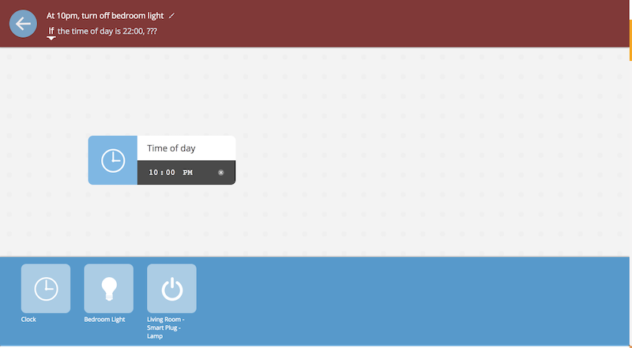

Next we select our output: a smart bulb named "Bedroom Light". Drag the light you want to turn off at 10pm to the right 
side of the Rule space.

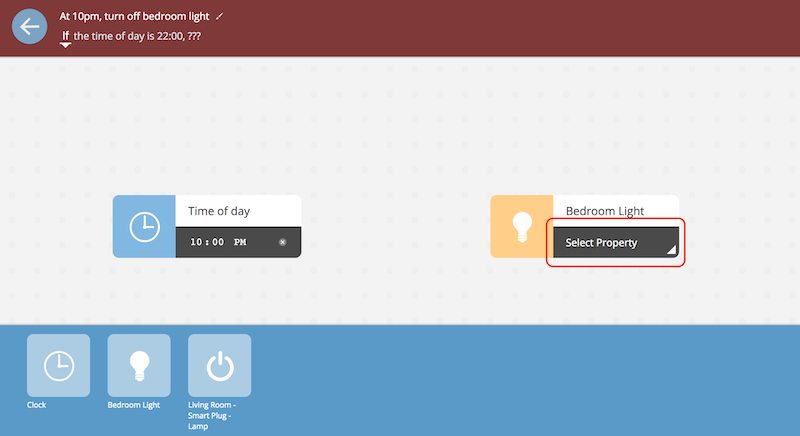

To complete the rule, select the desired property of the smart light that you want to set at 10pm. 
In this example, we want the bedroom light to turn “Off” at 10pm. Go to the light's drop down menu and select ‘Off’. 
The clock and light bulb rectangles should now be connected by a black line, and the “If” statement under 
your Rule name should be updated to reflect the logic of this rule.

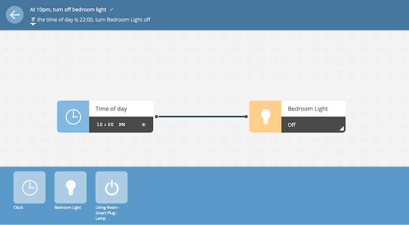

In the top left hand corner, click the tiny pencil near "Rule Name" to edit the name of your rule. For example, 
you can name this rule “At 10pm, turn off bedroom light”. 
For clock-based rules, the “If” statement below the name is appropriate logic. For other situations, such as 
turning on a light only when a door is open, you can change it to "While" instead. When you have more than 
one input parameter, you can select "And" or "Or" as the logical condition to tie together the input parameters.

Click on the back-arrow button in the upper left-hand corner of the Rule space (next to the name), 
to save the rule and return to the main Rule overview page.

### View/Edit, Disable/Enable, or Remove a Rule

From the main Rules view, each rule is represented by a rectangle. 
* View/Edit. You can view or change a rule by hovering over the middle of the rectangle and selecting the "Edit" button. 

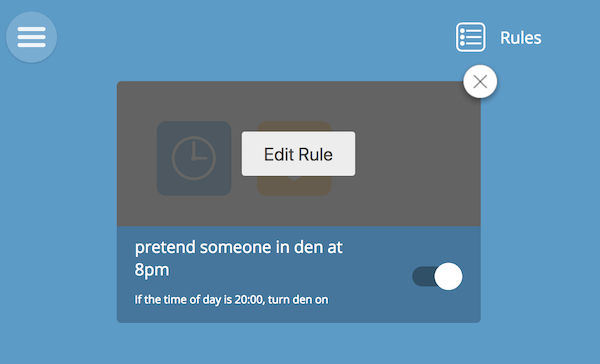

* Disable/Enable. You can disable a rule by toggling the "switch" element to the left, which will turn the circle color 
to grey. You can re-enable the rule by toggling the switch element back to the right, turning the circle back to white.

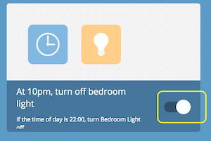

* Remove. To remove (permanently delete) a rule, hover over the rule rectangle and click on the "(x)" in the upper 
right-hand corner.

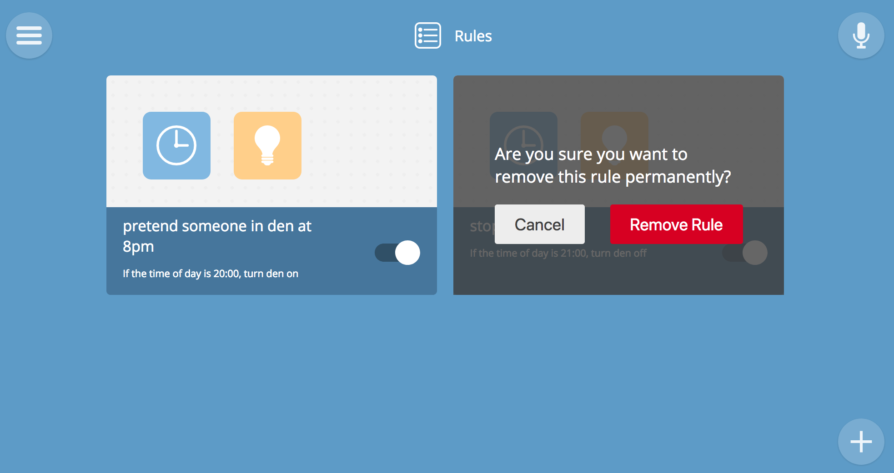

## V. Using Logging

The logging page is visible in the main navigation menu. Any devices that can be logged will be visible from
the configuration screen, accessed by clicking the plus icon in the lower right corner. Select the device you want to log,  the property you want to log, and duration of log data you want to store on your gateway.

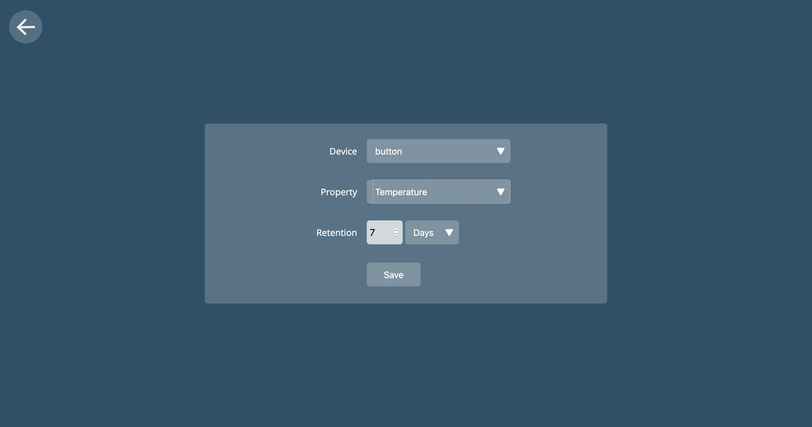

## VI. Floorplan: Map the Location of Your Devices

The Floorplan allows you to view your devices as they are positioned within your home. It shows all your devices, 
consistent with what you would see on the Things page, but it lets you see their states mapped over the layput of 
your home. You can still click an icon to change its state, the same as you would on the Things page. However, 
one interaction difference is that you need to click-and-hold on an icon to open the thing's detailed view. 

### Create a Floorplan

First sketch a floorplan of your home, and save it as a digital image. You can draw one by hand and take a picture of it, 
or use an illustrator tool. (If you take a picture of the floorplan using your smartphone, you can upload the image 
directly to your gateway from the phone's browser.)

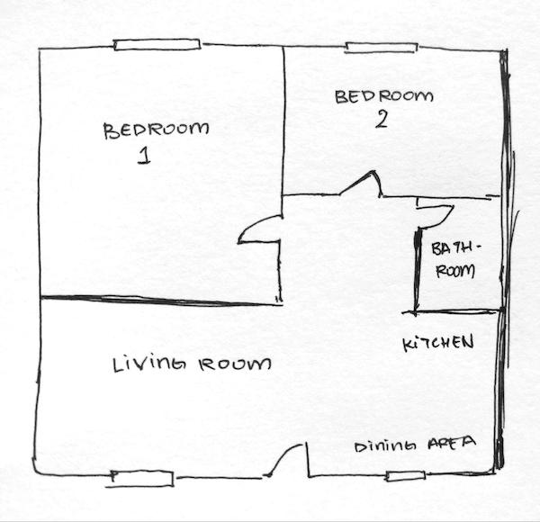

**TIP**: Save your digital drawing as an SVG file with white lines and a transparent background, using a tool like Inkscape or Sketch, for a minimalist look.

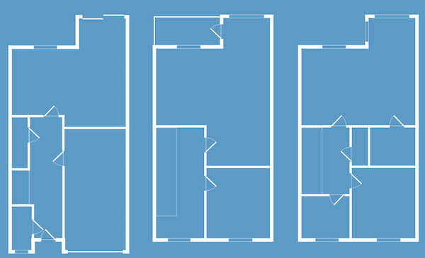

### Upload Floorplan

Click on the pencil icon  in the lower right corner of the floorplan 
page to enter edit mode. An "upload file" button will appear -- click on it to select the floorplan image to be uploaded. 

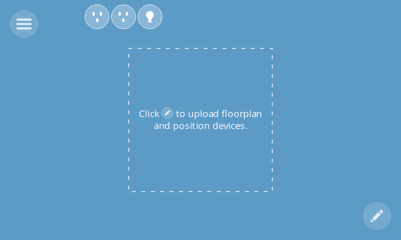

After the floorplan image is uploaded, make sure you are still in edit mode, and then drag the thing icons from the top 
of the page onto the floorplan. Click the check mark  
in the lower right corner when done.

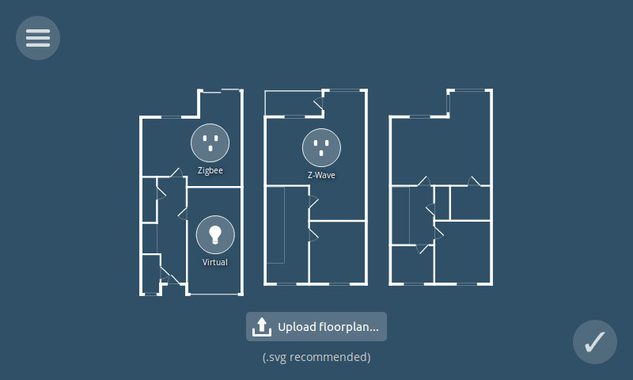

## VII. More Add-Ons: Further Extend your Gateway’s Capabilities

The gateway has an add-ons system so that you can extend its capabilities. A few add-ons are installed by default 
(Web Thing, Zigbee, and Z-Wave) so that your gateway will work with a large number of commercial devices right 
out of the box. However, you can boost support for additional devices if they are supported by an Add-on. You'll 
find the Add-on page under Settings.

### Locate and Install More Add-Ons As Needed

From the Settings menu, select Add-Ons. 

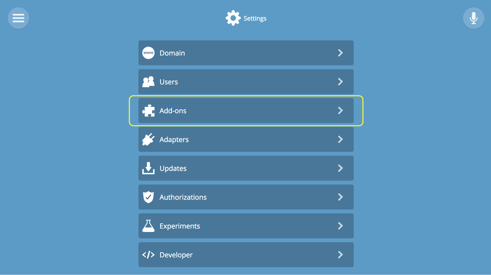

To enable more Add-Ons, click the "(+)" button in the lower right to browse the add-on list, 
then select ` + Add` to enable any additional add-ons. For example, if you have TP-Link or HomeKit compatible 
devices at home, you can install their add-ons, then discover and pair the devices so that they can be managed 
by your Mozilla gateway. 

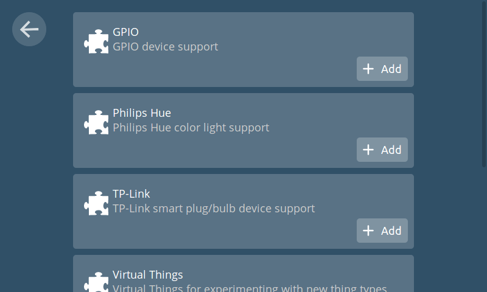

New add-ons will continue to be developed to enable control of newly supported devices, so check back periodically 
to scan new Add-ons in the list. You can submit requests for additional device support in the issues tab of the 
[gateway software development site](https://github.com/mozilla-iot/gateway/issues).

## VIII. Additional Settings

Browse the other pages listed under the Settings menu to find additional configuration and capabilities. 

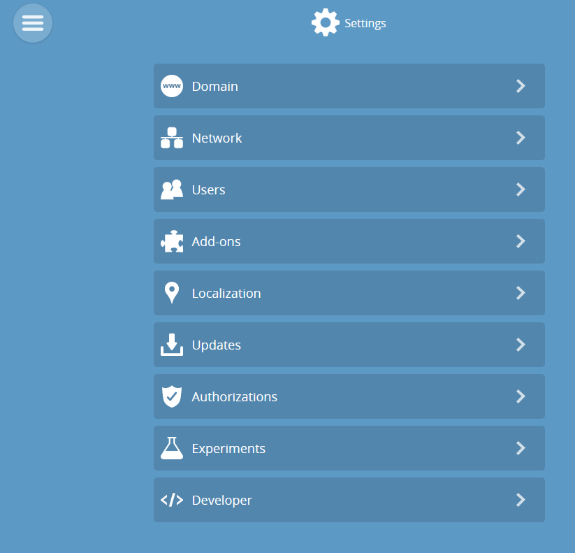

### Domain

The default localhost name is gateway.local, but you can change it to match your subdomain or choose a different name.

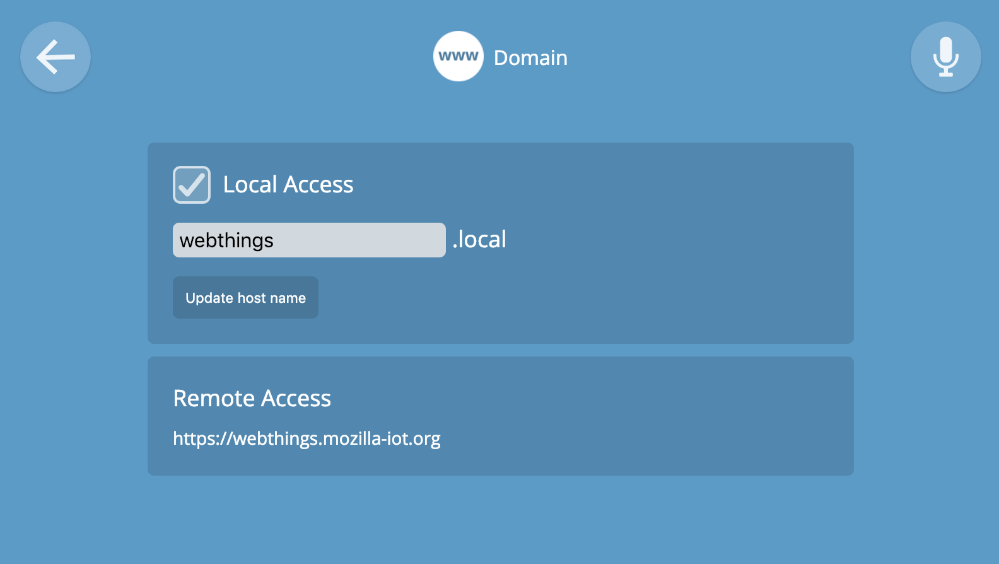

### Network

A Raspberry Pi gateway can connect to your local network using Wi-Fi or Ethernet. On the network configuration page you can 
see which settings are active, and click either option to change the configuration. Be careful with these settings, because 
if your gateway loses access to the local network, your ability to access the UI in a web browser will stop working.

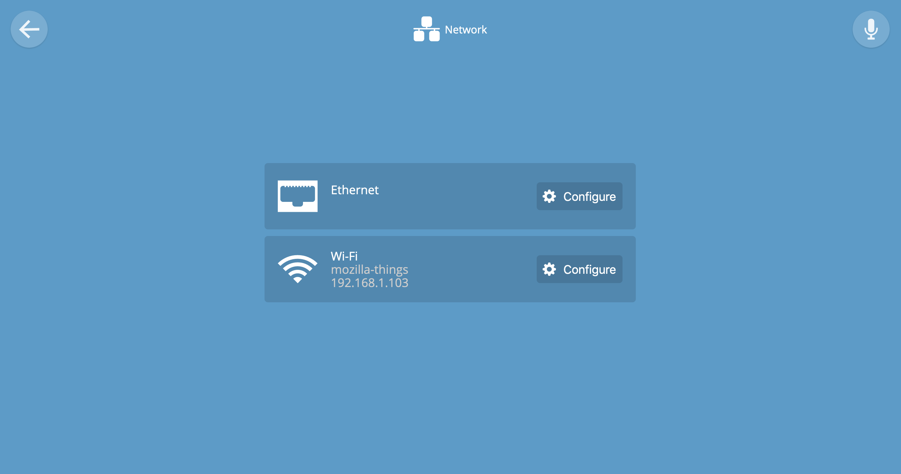

### Users

You can add as many user accounts as you like, so that everyone has their own unique login. Although all users currently have the same access and control privileges, a future feature will be to allow lesser privileges to some users, 
such as children or guests.

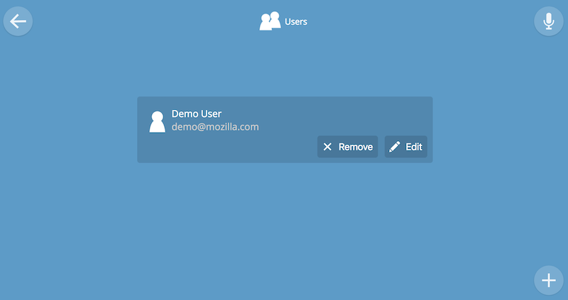

Click the "(+)" icon to provision more user accounts.

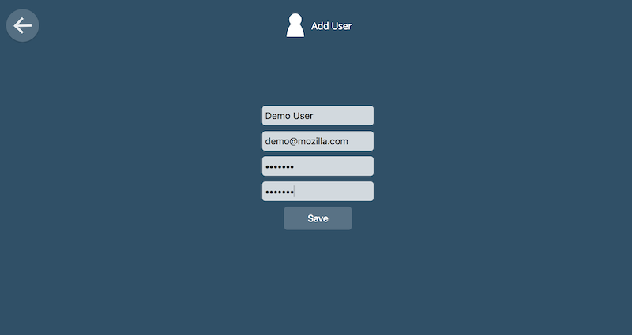

### Add-ons

The gateway supports a unique and flexible Add-on framework that helps users tie legacy devices, non-IP devices, and other 
non-standard devices into the web thing API framework. Only three add-ons are installed by default, and the rest must be 
added manually by the user. Because the add-on upgrades are independent from the core gateway application, they can be 
updated at any time.

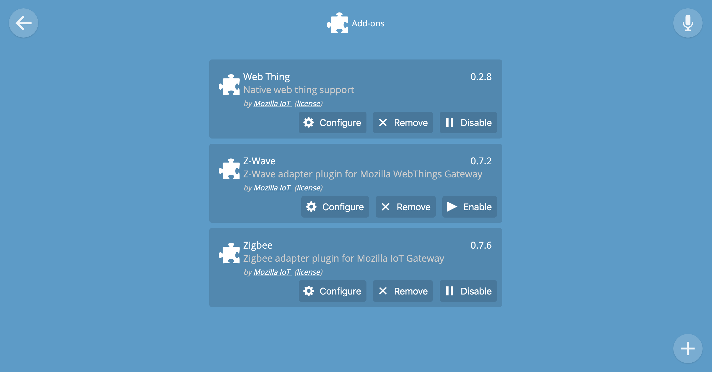

Click the "(+)" icon to install optional add-ons.

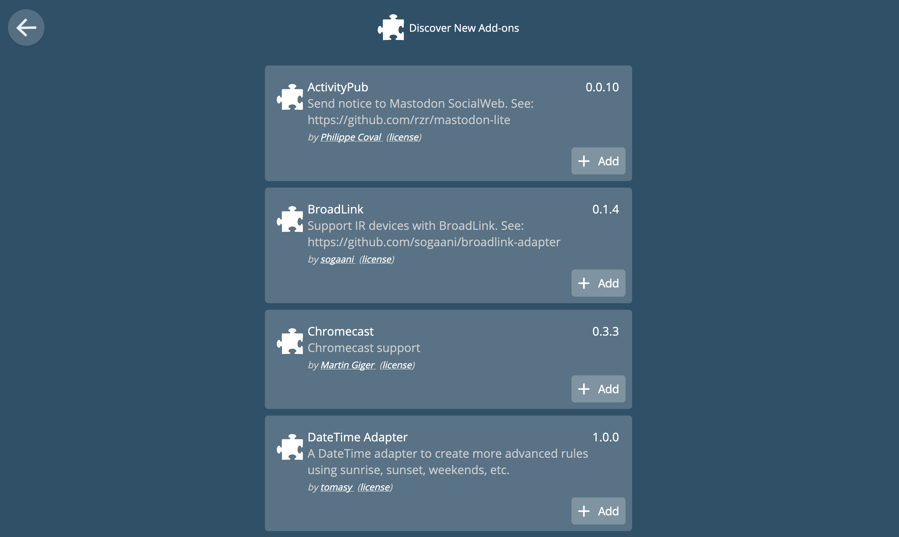

Some add-ons require configuration in order to function (e.g., Pulse, Weather, ONVIF). Others work as soon as they are added 
(e.g., Virtual Things). 

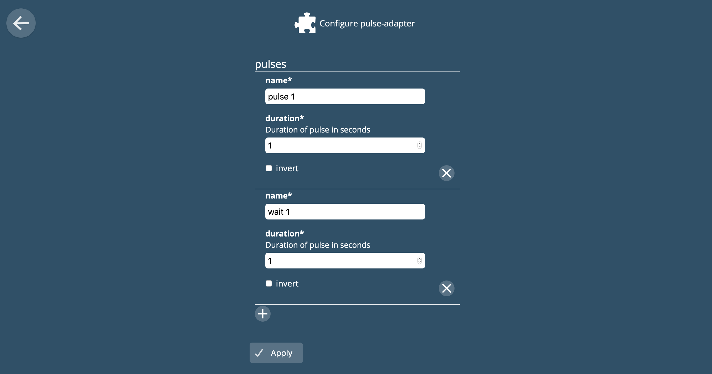

### Updates

Assuming your gateway is connected to the Internet, system updates will be applied automatically when a new 
stable release is ready. New versions are being released approximately quarterly.

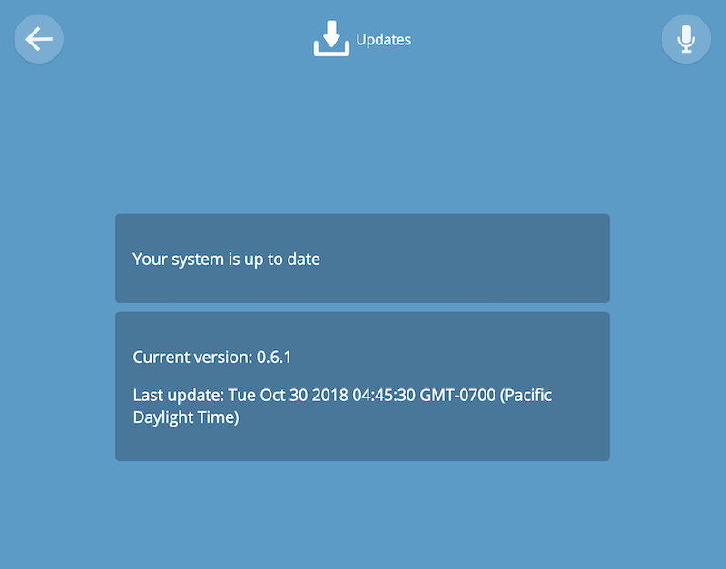

### Authorizations

Authorizations are enabled in "Settings" by selecting "Developer => Create local authorization". This page shows 
whether or not an authorization has been enabled.

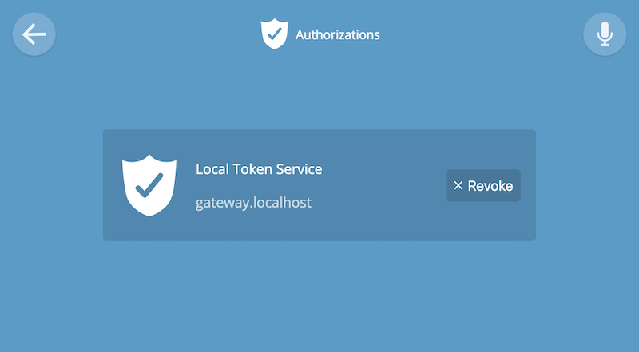

### Experiments

You can try out experimental new features by enabling them in Experiments.

### Developer

On the "Developer" page you can enable ssh, for connecting directly to the Raspberry Pi console. The default 
username is "pi", and the default password is "raspberry". If you decide to enable ssh, we recommend that you 
immediately ssh into the RPi to change the default password. Type the password command `$ passwd` and follow the prompts 
to change the pi user's password.

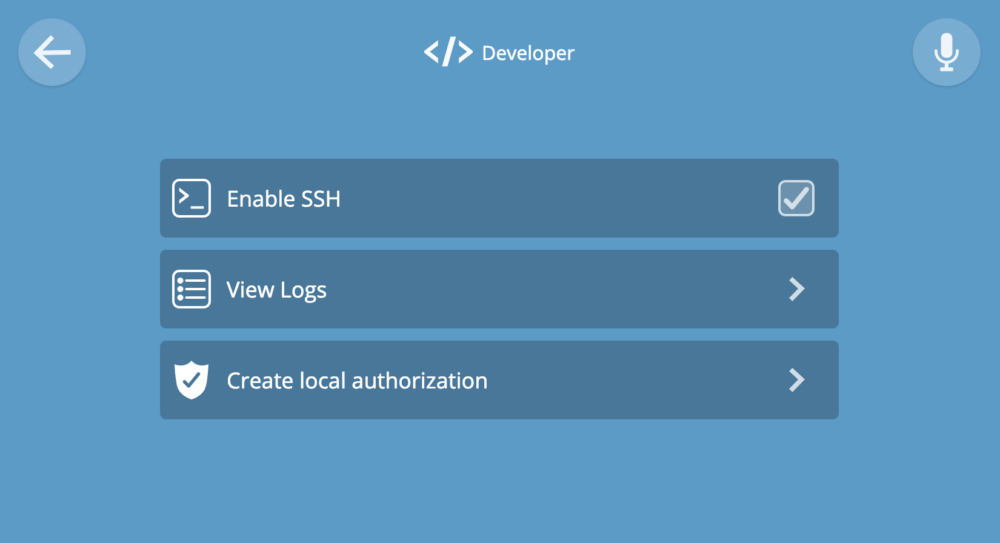

Click "View Internal Logs" to see raw logs displayed in your browser.

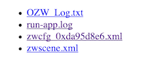

Click "Create local authorization" to establish a secure web token that can be exchanged with 3rd party 
applications and services that you may want to enable, or simply for accessing the data using your own 
development tools.

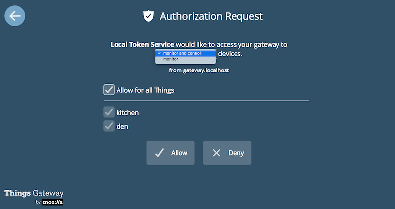

## IX. Support

For support, please sign up to our IoT [Discourse forum](https://discourse.mozilla.org/c/iot), email us at iot@mozilla.com, join us on [Matrix](https://chat.mozilla.org) in the #iot channel, or post issues on [GitHub](https://github.com/mozilla-iot/gateway/issues). 

## Appendix: Tips on Pairing and Unpairing Smart Devices

Although you typically can follow manufacturer instructions to pair and unpair devices, there are additional tricks to 
discovering devices. Some devices have a "chain link" or other button that you should click when you are ready to scan 
for the new device. Other products have reset buttons that you have to hold for some period of time to reset the device. 
Still others require multiple power cycles, double-button presses and various schemes. Unfortunately there is no common 
approach across a broad spectrum of device makers! Our supported devices wiki will likely be your best bet to see methods 
that have worked for us.
